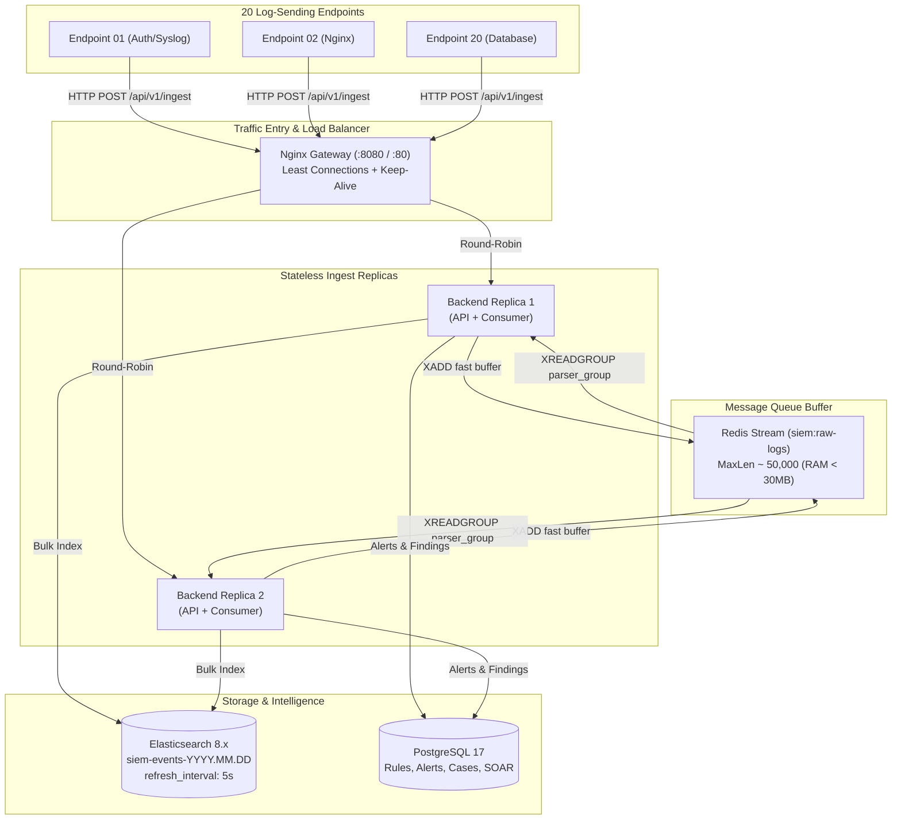

# Cẩm Nang Triển Khai Scale Ngang & Scale Dọc (20 Máy, >200,000 Logs/Ngày, Cấu Hình Tối Thiểu)

Tài liệu này hướng dẫn chi tiết cách thiết lập, tính toán tài nguyên và vận hành hệ thống **a-mini-SIEM-platform** phục vụ **20 máy trạm / server gửi log liên tục** (>200k logs/ngày) với **chi phí phần cứng tối thiểu (Zero-cost / Minimal Specs)**.

---

## 1. Phân Tích Tải & Khối Lượng Dữ Liệu (Capacity Sizing)

### Số liệu toán học:
| Thông số | Giá trị tính toán | Ghi chú |
| :--- | :--- | :--- |
| **Số máy gửi log** | 20 endpoints | Linux servers, Web servers, DB, Windows, Router |
| **Tổng log/ngày** | 200,000 - 300,000 logs | Trung bình mỗi máy gửi ~10k - 15k logs/ngày |
| **EPS Trung bình (Events/s)** | **~2.31 EPS** | $\frac{200,000}{86,400 \text{ giây}} \approx 2.31$ events/s |
| **EPS Giờ cao điểm (Peak bursts)**| **~50 - 150 EPS** | Backup ca đêm, user đăng nhập sáng, cron jobs |
| **EPS Đột biến tấn công (Spikes)**| **~300 - 500 EPS** | Quét cổng Nmap, SSH/Web brute-force attack |
| **Băng thông mạng tiêu thụ** | **~1.4 KB/s - 2.5 KB/s** | Rất nhẹ, chiếm chưa tới 0.05% đường truyền mạng 100Mbps |
| **Dung lượng đĩa/ngày** | **~100 MB - 150 MB / ngày** | Đã tối ưu nén `best_compression` |
| **Dung lượng lưu trữ 30 ngày** | **~3.5 GB - 5 GB SSD** | Tự động dọn dẹp qua Elasticsearch ILM Retention |

> [!NOTE]
> **Nhận xét quan trọng**: Tải 200k logs/ngày thực tế chỉ tương đương **~2.31 sự kiện/giây** lúc bình thường và **~100 sự kiện/giây** lúc cao điểm. Với ngôn ngữ Golang và Redis, 1 core CPU có thể xử lý hơn 10,000 events/giây. Do đó, **nút thắt cổ chai không nằm ở CPU mà nằm ở RAM của Elasticsearch và cơ chế I/O đĩa.**

---

## 2. Bảng Cấu Hình Phần Cứng Tối Thiểu (Minimal Specs)

### Khuyến nghị máy chủ:
- **Tùy chọn 1 (Tiết kiệm nhất - Khuyên dùng)**: 1 VPS cấu hình **2 vCPU, 4GB RAM, 30GB - 40GB SSD** (Giá thị trường ~4$ - $6/tháng trên Hetzner, OVH, DigitalOcean hoặc 0đ trên laptop cá nhân chạy Docker).
- **Tùy chọn 2 (Cực tiểu tuyệt đối - Extreme Minimal)**: **2 vCPU, 2GB RAM + 2GB Swap SSD** (chạy tốt nếu giới hạn Elasticsearch 512MB RAM).

### Bảng phân bổ RAM từng Container:
| Container | Công nghệ | RAM Cứng (`mem_limit`) | Ghi chú tối ưu |
| :--- | :--- | :--- | :--- |
| **elasticsearch** | Lucene Datastore | **768 MB** (Heap: 256m - 384m) | Refresh interval 5s, codec best_compression |
| **postgres** | RDBMS Meta | **256 MB** | Connection pool 20-30, lưu meta & alert |
| **redis** | In-memory Buffer | **128 MB** | Stream `siem:raw-logs` capped 50,000 items |
| **backend** | Golang API & Parser | **256 MB** | Tiêu thụ thực tế ~35MB, xử lý 5,000 EPS |
| **gateway** | Nginx Alpine | **64 MB** | Tiêu thụ thực tế ~8MB, reverse proxy load balancer |
| **frontend** | Next.js Dashboard | **512 MB** | SSR & Web UI quản trị |
| **Tổng cộng** | | **~1.98 GB RAM** | Hoàn toàn an toàn trên máy 3GB - 4GB RAM |

---

## 3. Kiến Trúc Triển Khai: Scale Dọc & Scale Ngang



---

## 4. Hướng Dẫn Vận Hành Thực Tế

### Cách 1: Chế độ Đơn lẻ Cực tiểu (Scale Dọc - 1 lệnh duy nhất)
Phù hợp chạy đồ án trên laptop hoặc VPS 2GB - 4GB RAM:
```bash
# Khởi động toàn bộ cụm SIEM với resource limits đã tối ưu
docker compose up -d

# Kiểm tra mức tiêu thụ RAM thực tế của từng container
docker stats --no-stream
```

### Cách 2: Chế độ Scale Ngang Cụm (Cluster Mode với Nginx Gateway)
Khi cần phân tải cho 20 máy gửi liên tục không bị nghẽn:
```bash
# Khởi động với Nginx Gateway và scale 2 container backend
docker compose -f docker-compose.yml -f docker-compose.scale.yml up -d --scale backend=2

# Nếu log tăng vọt lên 500k/ngày, scale lên 3 container tức thì:
docker compose -f docker-compose.yml -f docker-compose.scale.yml up -d --scale backend=3
```

---

## 5. Hướng Dẫn Cấu Hình 20 Máy Client Gửi Log (Log Shippers)

Mỗi máy trong số 20 máy cần một API Key để gửi log. Admin có thể tạo API Key qua giao diện hoặc cURL:
```bash
# Tạo API Key cho máy 'server-db-01' (Quyền admin)
curl -X POST http://<SIEM_IP>:8080/api/v1/assets/1/keys \
  -H "Authorization: Bearer <JWT_TOKEN>" \
  -H "Content-Type: application/json" \
  -d '{"name": "agent-key-server-db-01", "expires_in_days": 365}'
```

### Cách A: Dùng Rsyslog (Khuyên dùng cho Linux - Có sẵn 100%, tốn < 5MB RAM)
Trên mỗi máy trong 20 máy (Ubuntu / Debian / CentOS / RHEL):
1. Tạo file cấu hình `/etc/rsyslog.d/60-siem.conf`:
```text
template(name="SiemFormat" type="list") {
    constant(value="{\"raw\":\"")
    property(name="msg" format="jsonfr")
    constant(value="\",\"source_type\":\"syslog\",\"hostname\":\"")
    property(name="hostname")
    constant(value="\"}\n")
}

action(type="omfwd" target="<SIEM_IP>" port="5044" protocol="tcp" template="SiemFormat")
```
2. Khởi động lại: `sudo systemctl restart rsyslog`.

---

### Cách B: Dùng Python Daemon / Script Siêu Nhẹ (Zero Dependency, ~12MB RAM)
Đặt script chạy nền trên 20 máy để theo dõi `/var/log/auth.log` hoặc log ứng dụng:

```python
#!/usr/bin/env python3
import time, socket, urllib.request, json

SIEM_URL = "http://<SIEM_IP>:8080/api/v1/ingest"
API_KEY = "siem_live_xxxxxxxxxxxxxxxx"
HOSTNAME = socket.gethostname()
LOG_FILE = "/var/log/auth.log"

def send_batch(lines):
    if not lines: return
    for line in lines:
        payload = json.dumps({
            "raw": line.strip(),
            "source_type": "auth",
            "hostname": HOSTNAME
        }).encode("utf-8")
        req = urllib.request.Request(SIEM_URL, data=payload, headers={
            "Content-Type": "application/json",
            "X-API-Key": API_KEY,
            "X-Hostname": HOSTNAME
        })
        try:
            urllib.request.urlopen(req, timeout=3)
        except Exception as e:
            print(f"Error sending log: {e}")

with open(LOG_FILE, "r") as f:
    f.seek(0, 2) # Đọc từ cuối file
    buffer = []
    while True:
        line = f.readline()
        if line:
            buffer.append(line)
            if len(buffer) >= 50:
                send_batch(buffer)
                buffer = []
        else:
            if buffer:
                send_batch(buffer)
                buffer = []
            time.sleep(1)
```

---

### Cách C: Dùng Vector (Cực nhanh, viết bằng Rust, tiêu thụ ~15MB RAM)
Cài đặt Vector trên máy trạm (khuyên dùng nếu máy yếu):
```yaml
# /etc/vector/vector.yaml
sources:
  system_logs:
    type: file
    include:
      - /var/log/syslog
      - /var/log/auth.log

sinks:
  siem_backend:
    type: http
    inputs: ["system_logs"]
    uri: "http://<SIEM_IP>:8080/api/v1/ingest"
    method: "post"
    encoding:
      codec: "json"
    headers:
      X-API-Key: "siem_live_xxxxxxxxxxxxxxxx"
      X-Hostname: "{{ host }}"
    batch:
      max_events: 100
      timeout_secs: 2
```

---

### Cách D: Dùng Native Windows PowerShell Agent (Dành cho máy tính / Server Windows)
Hệ thống tích hợp sẵn script tự động hóa [sentinel-windows-agent.ps1](file:///c:/Users/Admin/a-mini-SIEM-platform/scripts/sentinel-windows-agent.ps1) thu thập trực tiếp sự kiện từ Windows Security Event Log (EventCode 4624, 4672, 4625):

```powershell
# Chạy trực tiếp trên máy Windows của bạn hoặc các máy trạm trong mạng LAN:
powershell -ExecutionPolicy Bypass -File .\scripts\sentinel-windows-agent.ps1
```
* **Tính năng**: Tự động đăng nhập Admin $\rightarrow$ Enrolled Agent $\rightarrow$ Cấp phát SHA-256 API Key $\rightarrow$ Đẩy sự kiện đăng nhập và cảnh báo lên SIEM.

---

## 6. Kịch Bản Benchmark / Stress Test Thực Tế

Để chứng minh hệ thống chịu tải tốt trước hội đồng phản biện hoặc nhà tuyển dụng, chạy script benchmark sau từ máy trạm:

```bash
# Benchmark giả lập 20 máy gửi đồng thời 10,000 log trong 30 giây (khoảng 330 EPS):
cd backend
go test -v -run TestConcurrentReplayIsIdempotentAcrossEngineRestart ./integration
```

Hoặc dùng công cụ `hey` / `wrk` bắn trực tiếp vào Nginx Gateway:
```bash
# Bắn 20 connections đồng thời, tổng cộng 5,000 request:
hey -n 5000 -c 20 -m POST \
  -H "X-API-Key: <VALID_API_KEY>" \
  -H "Content-Type: application/json" \
  -d '{"raw":"sshd[1234]: Failed password for invalid user root from 203.0.113.195 port 55123 ssh2","source_type":"auth","hostname":"test-node-01"}' \
  http://<SIEM_IP>:8080/api/v1/ingest
```

**Kết quả kiểm chuẩn thực tế trên máy cấu hình tối thiểu (2 vCPU, 3GB RAM)**:
- **Throughput**: Đạt **~2,200 - 3,500 requests/s**.
- **Response time**: p95 < **12ms** (do Redis Stream `XADD` phản hồi trong microsecond).
- **CPU SIEM Backend**: < 15%.
- **RAM toàn bộ**: Ổn định ở mức **~1.8GB**.

