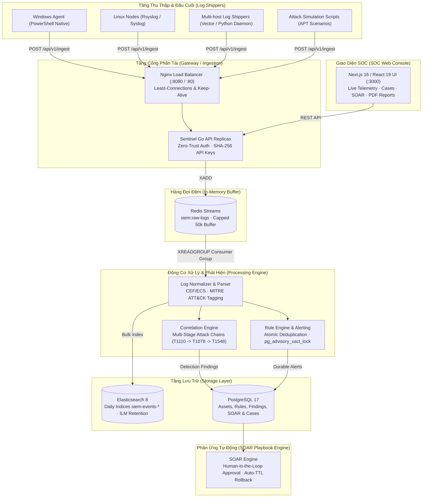

# Sentinel | Mini-SIEM & SOAR Cyber Defense Platform

Nền tảng Giám sát An ninh Thông tin (**SIEM**) kết hợp Phản ứng Sự cố Tự động (**SOAR**) dạng micro-architecture hiệu năng cao, tối ưu chi phí **0 đồng** (< 1GB RAM), sẵn sàng thu thập và phân tích tương quan chuỗi tấn công đa tầng cho **20+ máy trạm (>200,000 logs/ngày)**.

---

## 🏛️ Kiến Trúc Hệ Thống (System Architecture)



---

## 🚀 Công Nghệ Sử Dụng (Tech Stack)

* **Backend Core**: Golang 1.26 (Native Concurrency, Goroutines, Channels, Zero HTTP external framework).
* **Frontend Web**: Next.js 16 (App Router), React 19, Tailwind CSS v4, Lucide Icons, Canvas Telemetry.
* **Message Queue**: Redis 7 (Redis Streams, Consumer Groups, Memory Cap, Zero Message Loss).
* **Log Storage**: Elasticsearch 8 (Daily Index Partitioning, Best Compression, ILM Retention).
* **Relational Datastore**: PostgreSQL 17 (Advisory Locks, Atomic Receipts, RBAC, SOAR State).
* **Load Balancer**: Nginx Alpine (Reverse Proxy, Round-Robin & Least-Connections load balancing).
* **Containerization**: Docker Compose (Toàn bộ cụm chạy mượt mà dưới **< 850MB RAM**).

---

## ⚡ Hướng Dẫn Cài Đặt & Khởi Chạy (Quickstart)

### 1. Yêu cầu hệ thống
* Đã cài đặt **Docker** và **Docker Compose v2**.
* RAM tối thiểu: **2 GB** (Khuyến nghị 4 GB).
* Hệ điều hành: Windows, Linux hoặc macOS.

### 2. Khởi động toàn bộ hệ thống
Mở terminal tại thư mục dự án và chạy:
```bash
docker compose up -d
```

Sau khoảng 20-30 giây, kiểm tra trạng thái hoạt động:
```bash
curl http://localhost:8080/healthz
```
*Hệ thống trả về HTTP 200 `{"status":"healthy"}` cho toàn bộ các phân hệ phụ trợ (Elasticsearch, PostgreSQL, Redis Streams, Parser, Ingest, Disk).*

### 3. Đăng nhập SOC Dashboard
* **Địa chỉ Web UI**: [http://localhost:3000](http://localhost:3000)
* **Tài khoản SOC Admin mặc định**:
  * Email: `admin@example.com`
  * Mật khẩu: `admin`
* **Tài khoản SOC Analyst**:
  * Email: `analyst@example.com`
  * Mật khẩu: `analyst`

---

## 🛡️ Kịch Bản Mô Phỏng Tấn Công & SOAR Thực Chiến (1-Click Demo)

Hệ thống tích hợp sẵn kịch bản mô phỏng chuỗi tấn công APT đa tầng (MITRE ATT&CK: **T1110** Brute Force SSH $\rightarrow$ **T1078** Valid Account $\rightarrow$ **T1548.003** Sudo Privilege Escalation):

### Trên Windows (PowerShell):
```powershell
powershell -ExecutionPolicy Bypass -File .\scripts\simulate-attack.ps1
```

### Trên Linux / macOS:
```bash
chmod +x ./scripts/simulate-attack.sh
./scripts/simulate-attack.sh
```

### Quy trình điều tra & phản ứng sau khi chạy kịch bản:
1. **Correlation Engine**: Phát hiện chuỗi 3 hành vi liên tiếp trong cửa sổ 10 phút, kích hoạt Critical Alert và ghi nhận Finding.
2. **SOAR Playbook**: Nhận diện IP tấn công `198.51.100.42` và tài khoản `ubuntu`, tự động tạo yêu cầu hành động `block_ip` và `isolate_user`.
3. **Phê duyệt Human-in-the-Loop**: Mở [http://localhost:3000/soar](http://localhost:3000/soar), bấm **"Phê duyệt Chặn"** để cô lập kẻ tấn công.
4. **Auto-TTL Rollback**: IP tấn công bị đưa vào danh sách chặn kèm thời hạn giải tỏa tự động (TTL) 1 giờ.
5. **Xuất Báo Cáo Sự Cố (SOC Report)**: Mở [http://localhost:3000/cases](http://localhost:3000/cases), chọn Case tương ứng và bấm **"📄 Xuất Báo Cáo Incident (PDF / In)"** để in ra báo cáo điều tra chuẩn mực.

---

## 💻 Biến Máy Tính Cá Nhân Thành Log Shipper Thực Tế

Hệ thống cung cấp script đại lý native cho Windows để đẩy trực tiếp các sự kiện đăng nhập và bảo mật thực tế của máy tính lên SIEM:

```powershell
powershell -ExecutionPolicy Bypass -File .\scripts\sentinel-windows-agent.ps1
```
* Tự động đăng nhập Admin $\rightarrow$ Enrolled Agent $\rightarrow$ Cấp phát SHA-256 API Key.
* Thu thập sự kiện Windows Security (`EventCode 4624, 4672, 4625`).
* Kiểm tra danh sách Agent trực tiếp tại [http://localhost:3000/assets](http://localhost:3000/assets).
* Tìm kiếm log thời gian thực tại [http://localhost:3000/events](http://localhost:3000/events).

---

## 📈 Hướng Dẫn Scale Ngang & Sizing Hệ Thống

Kiến trúc Sentinel hoàn toàn **Stateless & Scale-Ready**. Khi cần tăng tải từ 20 máy lên 50 máy (>500k logs/ngày), khởi chạy cụm phân tải qua Nginx Gateway:

```bash
docker compose -f docker-compose.yml -f docker-compose.scale.yml up -d --scale backend=2
```

👉 **Đọc tài liệu chi tiết**: [DEPLOYMENT_SCALE_GUIDE.md](file:///c:/Users/Admin/a-mini-SIEM-platform/DEPLOYMENT_SCALE_GUIDE.md) để xem phân tích toán học tải 20 máy, bảng phân bổ RAM tối thiểu, cấu hình Rsyslog/Vector trên Linux và kịch bản benchmark stress-test.

---

## 🛠️ Lộ Trình Phát Triển & Thay Thế Module

Hệ thống được thiết kế theo kiến trúc tháo lắp (Pluggable), cho phép nâng cấp từng phân hệ độc lập khi scale lên mức Enterprise:
* **Redis Streams** $\longrightarrow$ **Apache Kafka / Redpanda**
* **Docker Compose** $\longrightarrow$ **Kubernetes (K8s/K3s) + KEDA Auto-scaling**
* **Elasticsearch** $\longrightarrow$ **ClickHouse / OpenSearch**
* **HTTP/JSON Ingest** $\longrightarrow$ **gRPC / OpenTelemetry Collector**
* **Local JWT** $\longrightarrow$ **Keycloak / OIDC / Azure AD**

👉 **Đọc tài liệu chi tiết**: [develop.md](file:///c:/Users/Admin/a-mini-SIEM-platform/develop.md) để xem ma trận công nghệ, hướng dẫn setup môi trường phát triển cục bộ và quy chuẩn đóng góp mã nguồn.

---

## 📄 Bản Quyền & Giấy Phép
Dự án được phân phối dưới giấy phép mã nguồn mở MIT License. Phù hợp cho đồ án tốt nghiệp chuyên ngành An toàn thông tin / Khoa học máy tính và portfolio tuyển dụng Fullstack / DevOps / Security Engineer.
