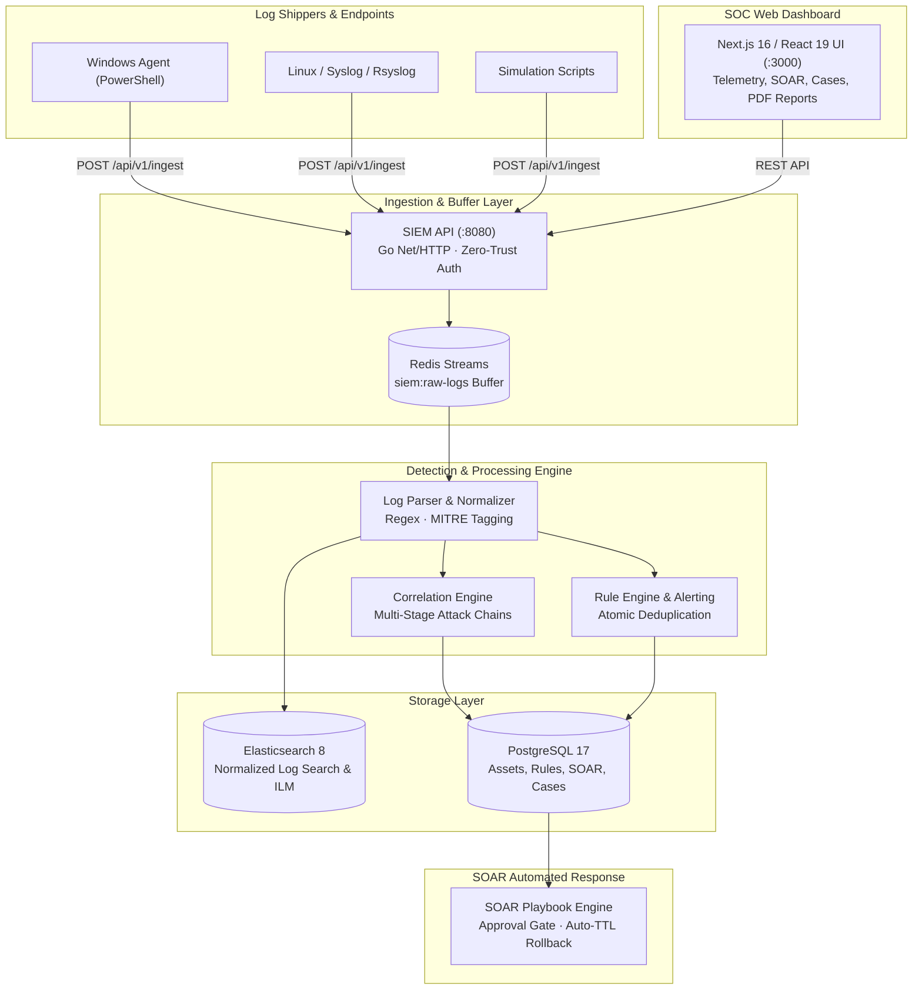

# Sentinel: Mini-SIEM & SOAR Platform

Hệ thống giám sát an toàn thông tin (SIEM) kết hợp phản ứng sự cố tự động (SOAR) dạng micro-architecture hiệu năng cao, xây dựng bằng **Golang**, **Next.js**, **Redis Streams**, **Elasticsearch**, và **PostgreSQL**.

---

## 🏛️ Kiến Trúc Hệ Thống



---

## 🚀 Công Nghệ Sử Dụng

* **Backend**: Go (Golang 1.26), Native Concurrency, HTTP Routing, Zero external HTTP framework.
* **Frontend**: Next.js 16 (App Router), React 19, Tailwind CSS v4, SVG Canvas Telemetry.
* **Log Ingest Buffer**: Redis 7 (Redis Streams, Memory Cap, Backpressure protection).
* **Storage & Search**: Elasticsearch 8 (Daily Index Partitioning, Best Compression, ILM Retention).
* **Relational DB**: PostgreSQL 17 (Advisory Locks, Atomic Receipts, RBAC, SOAR State).
* **Containerization**: Docker Compose (Tối ưu hóa tổng RAM toàn bộ hệ thống < 1GB).

---

## ⚡ Hướng Dẫn Cài Đặt & Khởi Chạy

### 1. Yêu cầu hệ thống
* Đã cài đặt **Docker** và **Docker Compose**.
* RAM tối thiểu: **2 GB** (Khuyến nghị 4 GB).

### 2. Khởi động toàn bộ hệ thống
```bash
docker compose up -d
```

Sau khoảng 20-30 giây, kiểm tra trạng thái hoạt động:
```bash
curl http://localhost:8080/healthz
```
Hệ thống trả về HTTP 200 `{"status":"healthy"}` cho toàn bộ 6 subsystem.

### 3. Đăng nhập Web Dashboard
* **Địa chỉ Web UI**: [http://localhost:3000](http://localhost:3000)
* **Tài khoản SOC Admin mặc định**:
  * Email: `admin@example.com`
  * Mật khẩu: `admin`
* **Tài khoản Analyst**:
  * Email: `analyst@example.com`
  * Mật khẩu: `analyst`

---

## 🛡️ Kịch Bản Mô Phỏng Tấn Công & SOAR 1-Click

Hệ thống tích hợp sẵn kịch bản mô phỏng chuỗi tấn công APT đa tầng (MITRE ATT&CK: **T1110** Brute Force SSH $\rightarrow$ **T1078** Valid Account $\rightarrow$ **T1548.003** Sudo Privilege Escalation):

### Chạy trên Windows:
```powershell
powershell -ExecutionPolicy Bypass -File .\scripts\simulate-attack.ps1
```

### Chạy trên Linux / macOS:
```bash
chmod +x ./scripts/simulate-attack.sh
./scripts/simulate-attack.sh
```

**Quy trình phản ứng sau khi chạy:**
1. Correlation Engine phát hiện chuỗi tấn công và tạo Critical Alert.
2. SOAR Engine tự động kích hoạt Playbook ngăn chặn và gửi yêu cầu phê duyệt.
3. Mở [http://localhost:3000/soar](http://localhost:3000/soar) để bấm **"Phê duyệt Chặn"** IP kẻ tấn công.
4. Kẻ tấn công bị cô lập với thời hạn tự động hoàn tác (TTL) sau 1 giờ.
5. Mở [http://localhost:3000/cases](http://localhost:3000/cases) để xuất **Báo Cáo Incident PDF** chính thức.

---

## 💻 Biến Máy Trạm Thành Log Agent

Để đẩy log bảo mật thực tế từ máy tính lên SIEM:
```powershell
powershell -ExecutionPolicy Bypass -File .\scripts\sentinel-windows-agent.ps1
```
* Kiểm tra danh sách Agent trực tiếp tại [http://localhost:3000/assets](http://localhost:3000/assets).
* Tìm kiếm log thời gian thực tại [http://localhost:3000/events](http://localhost:3000/events).

