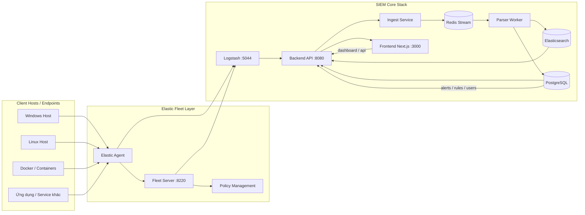

# Cấu trúc hệ thống SIEM hiện tại

Tài liệu này mô tả cấu trúc thực tế của hệ thống SIEM mini đang chạy trong dự án, theo hướng production-like thay vì chỉ là demo đơn giản.

## 1. Tổng quan kiến trúc



## 2. Mỗi service có vai trò gì

### 2.1. `postgres`
- Dùng làm storage chính cho dữ liệu cấu hình và nghiệp vụ.
- Lưu dữ liệu:
  - `assets`
  - `log_sources`
  - `rules`
  - `alerts`
  - `users`
  - `cases`, audit logs, v.v.
- Là nơi backend truy vấn về danh sách host, rule, alert và quyền người dùng.

### 2.2. `redis`
- Dùng làm queue và stream trung gian giữa ingest và parser.
- Dữ liệu raw log được đẩy vào stream trước khi xử lý.
- Đảm nhiệm vai trò buffering, decoupling và xử lý bất đồng bộ.

### 2.3. `elasticsearch`
- Dùng lưu trữ dữ liệu normalized event đã được parser xử lý.
- API truy vấn events, analytics, timeline, dashboards đều đọc từ Elasticsearch.

### 2.4. `fleet-server`
- Là thành phần chính của Elastic Fleet.
- Agent enroll và nhận policy từ đây qua cổng `8220`.
- Là trung tâm quản lý nhiều client / nhiều host / nhiều policy.
- Đảm bảo hệ thống không còn phụ thuộc vào cấu hình agent tách rời mà có quản lý tập trung.

### 2.5. `elastic-agent`
- Là agent chạy trên từng host hoặc service.
- Dùng để thu thập log từ file, syslog, Docker, Windows Event Log, ...
- Có thể gắn nhiều input trong cùng policy.
- Gửi dữ liệu tới Fleet Server hoặc tới Logstash tùy từng deployment.

### 2.6. `logstash`
- Là tầng chuyển tiếp nhận log từ Agent hoặc Beats.
- Chuyển dữ liệu sang backend HTTP ingest.
- Giữ mô hình hiện tại của dự án: agent không gửi trực tiếp tới backend, mà qua Logstash.

### 2.7. `backend`
- Phần cốt lõi của platform.
- Cung cấp REST API và xử lý nghiệp vụ:
  - auth/login
  - assets CRUD
  - ingest API
  - rule engine
  - alert lifecycle
  - analytics
  - dashboard data
  - case management
- Backend cũng đồng bộ asset và log_source khi agent enroll vào Fleet.

### 2.8. `ingest`
- Một service phụ để đưa log vào Redis Stream.
- Có thể được dùng bằng CLI hoặc HTTP producer.
- Phục vụ cho pipeline raw log -> parser.

### 2.9. `parser`
- Đọc dữ liệu từ Redis stream.
- Chuyển raw log thành normalized event.
- Enrich thông tin như hostname, source type, severity, category, IP, username, ...
- Gửi dữ liệu vào Elasticsearch.

### 2.10. `frontend`
- Giao diện Next.js cho dashboard.
- Hiển thị event, alert, asset, rule, case.
- Tương tác với backend qua API.

## 3. Luồng dữ liệu thực tế

### 3.1. Luồng log từ Linux/Windows

```text
Host / Service
   -> Elastic Agent
   -> Fleet Server (enroll + policy)
   -> Logstash
   -> Backend /api/v1/ingest
   -> Redis Stream
   -> Parser
   -> Elasticsearch
   -> Dashboard + Analytics
```

### 3.2. Luồng alert / rule

```text
Elasticsearch events
   -> Backend analytics / rule matcher
   -> PostgreSQL rules + alerts
   -> Frontend hiển thị alert
```

## 4. Mối quan hệ giữa Fleet và backend

Hệ thống hiện tại không chỉ là một stack Elastic đơn thuần, mà còn có một lớp ứng dụng SIEM của riêng dự án:

- Fleet quản lý agent và policy
- Backend quản lý asset, log source, users, alerts
- Redis và parser đảm nhiệm ingestion pipeline
- PostgreSQL và Elasticsearch là hai nguồn dữ liệu chính cho hệ thống

Nói cách khác:

```text
Fleet = quản lý collector / policy
Backend = quản lý SIEM business logic
Redis = queue / buffering
Elasticsearch = event store
PostgreSQL = config + alerts + identity + cases
```

## 5. Kết luận

Hệ thống hiện tại là một SIEM mini nhưng có kiến trúc rất gần với mô hình thực tế:

- có Fleet Server để triển khai nhiều agent
- có Logstash để chuyển tiếp log
- có backend quản lý asset + cấu hình
- có Redis làm queue và Elasticsearch làm kho dữ liệu sự kiện
- có PostgreSQL làm hệ thống dữ liệu cấu hình và cảnh báo

Đây là một hệ thống đủ “thật” để phát triển tiếp theo cho môi trường đa host, đa service và multi-tenant trong tương lai.
